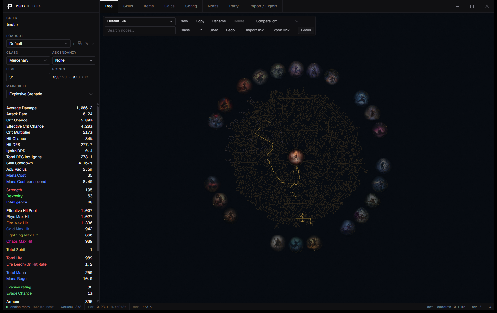

# PoB Redux

Path of Building for Path of Exile 2 as a native desktop app. The calculation engine is Path of Building
Community's own Lua code, run headless under an embedded LuaJIT. The app shows the same numbers as PoB
because it runs the same code.

- Engine: `crates/pob-engine` embeds LuaJIT and boots PoB's `Launch.lua` with drawing and input stubbed out.
  A JSON bridge exposes PoB's live build object to the app. A pool of extra engines runs calc-heavy scans in
  parallel.
- Shell: Rust and Tauri 2. Windows installer (NSIS). The CI workflow also builds Linux packages (.deb,
  AppImage), but those are untested.
- UI: Svelte 5. Dark, monochrome, hairline borders, monospaced numbers.

What works today: every PoB tab (tree, skills, items, calcs, config, notes, party, import), with PoB's own
numbers, tooltips and breakdowns. Builds import from share codes, PoB XML, pobb.in, Maxroll, poe.ninja,
poe2db.tw, Pastebin and Rentry links, and GGG's `.build` planner files.

Status: the tabs above are at parity with PoB. Windows is the current target, with installer polish,
auto-update and error reporting in progress. Linux packages come after that.



## Install

Download `PoB Redux_<version>_x64-setup.exe` from the Releases page and run it. It installs for the current
user only, and fetches the WebView2 runtime if Windows does not have it. Your builds stay where Path of
Building keeps them, so both apps can open the same files.

## Layout

```
pob-redux/
  crates/pob-engine/      headless PoB: LuaJIT host shim (lua/host.lua), JSON bridge (lua/bridge.lua),
                          worker engine pool (src/pool.rs), Rust API, `pobctl` CLI
  crates/pob-sync/        copies a PathOfBuilding-PoE2 checkout into src-tauri/resources/pob
  src-tauri/              Tauri app: engine thread, commands, `pob://` asset protocol, bundling
  src/                    Svelte frontend
  .github/workflows/      CI: Windows installer and Linux packages on every push
  pob-sync.toml           upstream checkout path and pinned commit
```

## Build

You need:

- Rust stable. On Windows, the MSVC toolchain. The first build compiles LuaJIT.
- Bun 1.4 or newer. This is what CI uses.
- Tauri's platform prerequisites. Windows: WebView2. Linux: `libwebkit2gtk-4.1-dev`, `libappindicator3-dev`,
  `librsvg2-dev`, `patchelf`, `libssl-dev`.
- A checkout of [PathOfBuilding-PoE2](https://github.com/PathOfBuildingCommunity/PathOfBuilding-PoE2) next
  to this repo. Or set `POB_SOURCE` to its path.

```sh
bun install
bun run sync                # copy PoB's Lua and data into src-tauri/resources/pob and decode the tree art. Run this first.
bun run sync:fast           # same, but keep the decoded tree art from the last sync
bun run tauri dev           # run the app with hot reload
bun run tauri build         # installers land in target/release/bundle/
bun run check               # type-check the frontend (svelte-check)
```

CI runs the same steps on every push (`.github/workflows/build.yml`) and uploads the Windows installer and
the Linux packages as artifacts.

If `NoDefaultCurrentDirectoryInExePath` is set in your shell, unset it before the first build. LuaJIT's
`msvcbuild.bat` needs cmd.exe to find `minilua` in the current directory.

## Update the PoB data

The installer bundles PoB's Lua and game data. The app never downloads data while it runs, and PoB's
built-in updater is inert (`LaunchSubScript` is a stub). To move to a newer PoB:

1. Pull the PathOfBuilding-PoE2 checkout.
2. Put the new commit hash in `pob-sync.toml`. `bun run sync` refuses to run if the checkout's HEAD differs
   from that pin. Pass `--allow-commit-mismatch` to override.
3. Run `bun run sync`. Use the full sync when the tree changed: tree art is decoded only with `--tree-assets`,
   and only for the newest `TreeData/<version>` folder.
4. Run the headless checks below, then open one of your builds in the app. `lua/bridge.lua` drives PoB's internals,
   so an upstream refactor can break it.
5. Build and release. CI reads the pin from `pob-sync.toml`, checks out that exact upstream commit and runs
   the same sync, so the repo alone describes a release.

Users get new data with a new app release. The status bar shows the bundled PoB version and commit, read
from `src-tauri/resources/pob/SYNC.json`. Do not edit files under `src-tauri/resources/pob/`. The next sync
overwrites them.

## Run checks without the UI

`pobctl` drives the engine from the command line.

```sh
bun run ctl -- --pob-root src-tauri/resources/pob methods                  # list bridge methods
bun run ctl -- --pob-root src-tauri/resources/pob call get_build           # call one method
bun run ctl -- --pob-root src-tauri/resources/pob stats build.xml          # load a build and print its sidebar
bun run ctl -- --pob-root src-tauri/resources/pob bench                    # time full recalculations
bun run ctl -- --pob-root src-tauri/resources/pob power build.xml --stat Life --pool 8   # node power, sequential vs pool; mismatches must be 0
bun run ctl -- --pob-root src-tauri/resources/pob gems build.xml --group 1 --pool 8      # gem DPS scoring, sequential vs pool
```

## Where builds are stored

PoB Redux reads and writes the same folder as Path of Building: `Documents/Path of Building (PoE2)/Builds`.
It reads PoB's `Settings.xml` to find a custom build path. It never writes that file.

Environment variables:

| Variable | Effect |
|---|---|
| `POB_REDUX_USER_DIR` | Parent folder for `Path of Building (PoE2)/`. Default: Documents |
| `POB_REDUX_POB_ROOT` | Use this PoB data folder instead of the bundled one |
| `POB_REDUX_OPEN` | Build XML to open at launch. Passing the path as the first argument does the same |
| `POB_REDUX_POOL` | Number of worker engines for node power and gem scoring. Default: half the cores, at most 8 |
| `POB_REDUX_MCP` | Start the MCP server on this port at launch, whatever the saved setting says |

## MCP server

The app can host an MCP (Model Context Protocol) server, so an AI client such as Claude Code, Claude
Desktop or Cursor can read and edit the build that is open. It is off by default. Turn it on in Options
(the gear in the status bar). That panel also shows the URL and ready-made client config with copy buttons.

The server listens on `http://127.0.0.1:7315/mcp` (the port is configurable), accepts local connections
only, and stops when the app closes. For Claude Code:

```sh
claude mcp add --transport http pob-redux http://127.0.0.1:7315/mcp
```

The tools mirror `pob-mcp`: load a build from a share code, link or file; read stats, the sidebar and
warnings; search and allocate the passive tree; equip items and manage gear sets; add and edit gems and
socket groups; set config options; save or export. Every change shows in the app as it happens.

## Contributing

Issues and pull requests are welcome. Before a pull request, run `bun run check` and the headless checks
above, then open one of your builds in the app and compare the sidebar with Path of Building itself.
Keep the numbers PoB's own: do not reimplement calculations in Rust or TypeScript.

## Licence

MIT. Path of Building Community is MIT as well. Its licence file is bundled with the app. See
[LICENSE](LICENSE).
